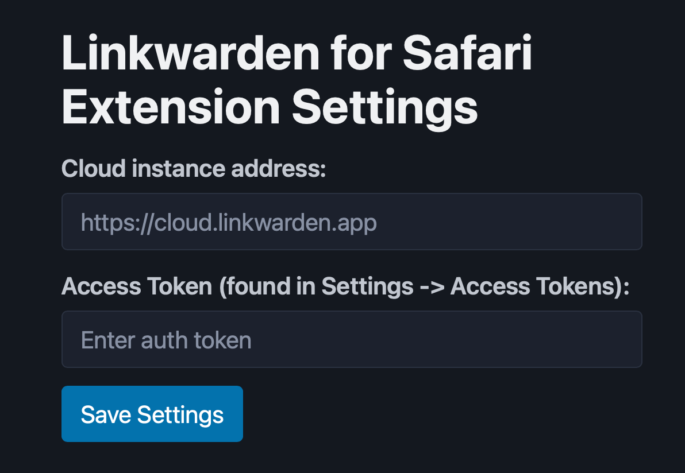
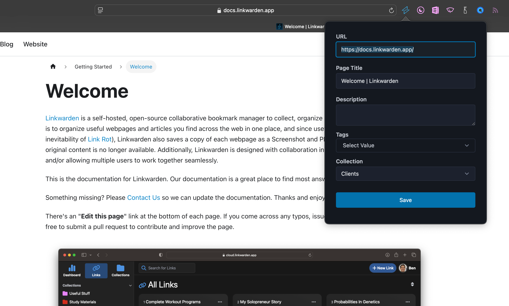

# Linkwarden Extension for Safari (macOS)

## Installation

* [Download the latest release](https://github.com/daltonrooney/linkwarden-safari-extension/releases) and build using Xcode.
* Add your instance address and access token in the Settings panel.

* Add the extension to your Safari toolbar if it isn't automatically added.
* Click the extension icon to add links to your Linkwarden account.

## Roadmap

- [ ] Set a preferred default collection.
- [ ] Option to import default meta description from page.
- [ ] Right-click on links to save to Linkwarden.
- [ ] iOS action sheet.
